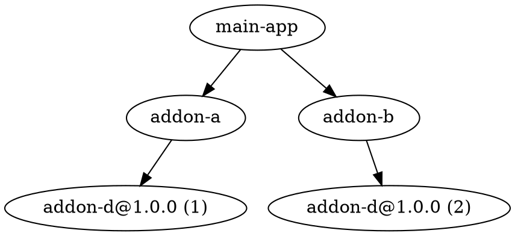
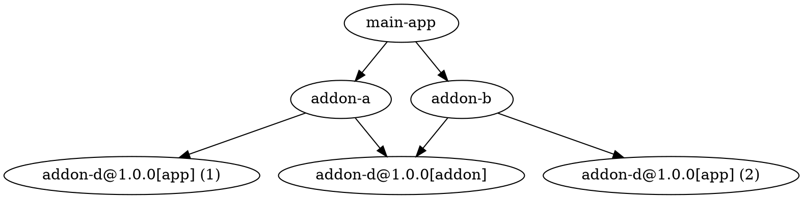

given:

where A, B, C, D, are all ember-addons

D's addon/ and app/ trees are currently built for both b and c.

For now, `app` must be built for each, but not for nested addons. (so this doesn't cause use grief here)
but `addon` is built, then merged, and the last is kept. Rendering all duplicate builds wasteful

problems:
  * wasteful build work, for duplicate nested addons (aiming to solve this one right now)
  * confusing issues, when two different versions are merged (aiming to warn, but solve this in the future)

Given:

I would like to make it so that:

* app continues to be built twice, once under the b namespace and once under the c namespace.
* addon is only built once (per version), as the subsequent merge makes this pointless.

Questions:

* how is the implemented today
  * can we simply skip the treeFor('addon') that is a duplicate, given some "checklist"
* how is concat of addons implemented today

